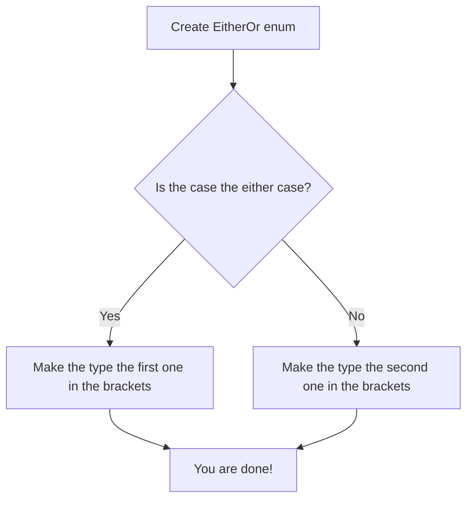

# Either-Or

In Swift, you can't include two types in one. What do you do? With the simple Either-Or enum, you can include two types in one in some easy steps!!

**Step One:** Declare the enum like this:
```swift
enum EitherOr<EitherType, OrType> {
  
}
```

**Step Two:** Add two cases to the enum: `either` and `or` with their associated types. (This should be easy. You know you shouldn't write `either(OrType)` or `or(EitherType)`)
```swift
enum EitherOr<EitherType, OrType> {
  case either(EitherType)
  case or(OrType)
}
```

**Step Three:** Declare an extension for `EitherOr` that conforms it to both `Hashable` and `Equatable` where `EitherType` and `OrType` conform to `Hashable`. You don't know what I mean? Here's the code:
```swift
extension EitherOr: Hashable, Equatable where EitherType: Hashable, OrType: Hashable {}
```

That's how you do it!

The process looks like this:



> **Note to alert readers:** You may have noticed a file called `Testing.playgroundbook.zip`. That is the place you can test with other features!
